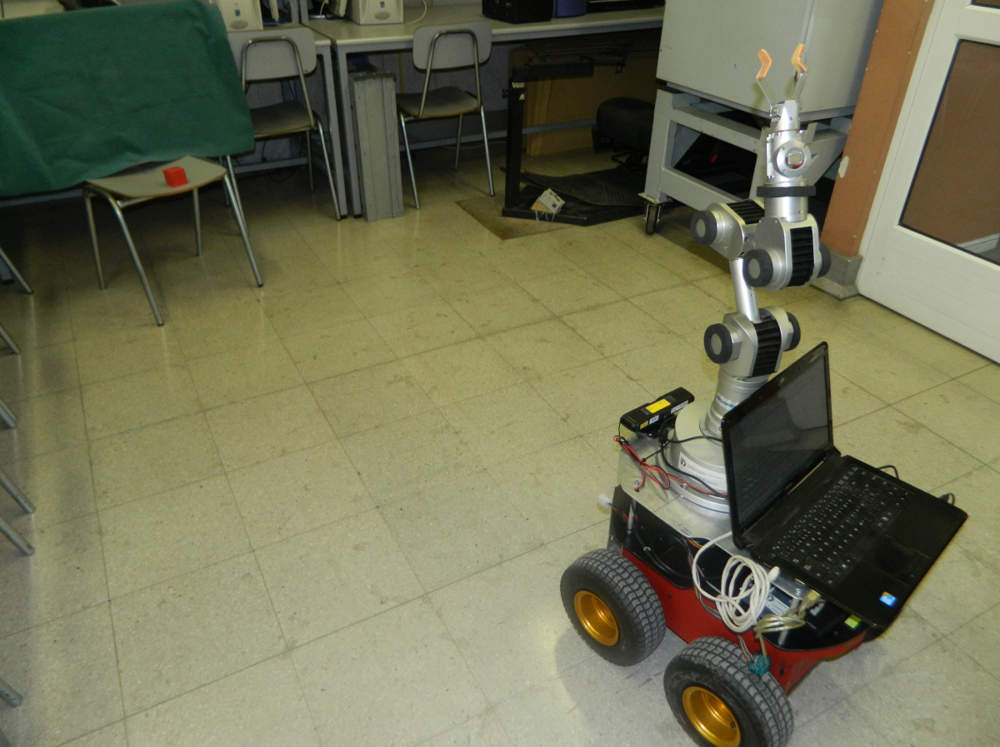

# MM_CTC
MM_CTC is the repository of the discrete-time computed-torque control (CTC) for mobile manipulators with PSO gain optimization that reduces trajectory tracking errors and energy consumption.

The code provided includes:

1. The source code in C/C++ of the discrete-time CTC control for a Pionner P3-AT with 
   a Katana 6M robotic arm. See files in /c_src_MM_CTC.
2. The source code in C/C++ of the discrete-time PD control for a Pionner P3-AT with 
   a Katana 6M robotic arm. See files in /c_src_MM_PID.
3. The source code in C/C++ of camera targe segmentation in OpenCV used to define the target reference for the mobile manipualtor robot in the laboratory experiments. See files in /c_src_camera_red_target_segmentation.
4. The simulation Matlab/Simulink files of the discrete-time CTC and PD controlles for the mobile manipulator model of the Pioneer P3-AT mobile base with the Katana 6M arm. See files in /simulation_Matlab_Simulink.
5. The experimental results data in folder /exerpimental_results_data.

Requires Visual Studio C/C++ and Matlab/Simulink.

Version 1.0  - 2025.11.29 

*Copyright (c) 2025 Robotics and Automation Laboratory of Pontificia Universidad
 Catolica de Chile under MIT License. See LICENSE.txt file.*

*Source: https://github.com/RAL-UC/MM_CTC*

---

---
## COMPILING THE SOURCE CODE 

Use Visual Studio to compile the C/C++ projects in the src_* folders.
Each folder has its own C/C++ project.  Please note you will need a Piooner P3-AT and a Katana 6M robotic arm in order to use the discrete-time CTC and PD controllers.

---
## RUNNING THE MODEL

Simply run the  **{*}.mdl** from Matlab/Simulink.

The simulation files will allow you to `simulate` the controllers implemented on the real robot and compare the trajectory tracking errors and the corresponding energy consumption.

---
## Additional Information

For information on advanced modelling of mobile manipulators using Mujoco see also: https://github.com/RAL-UC/SSMM 
---
