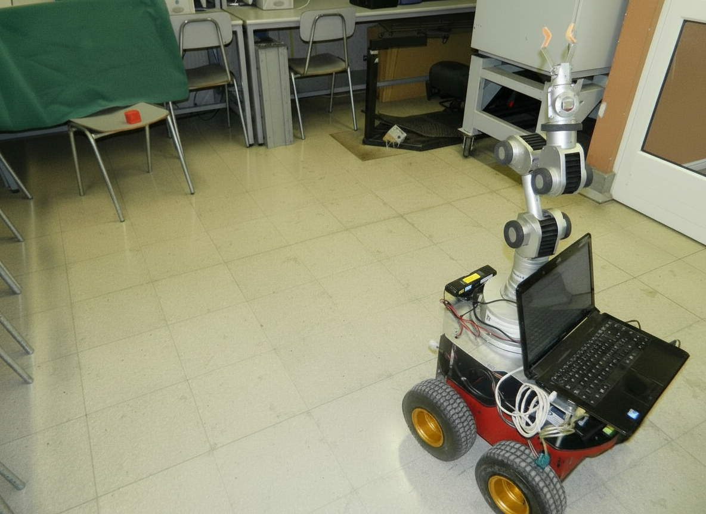

# MM_CTC

MM_CTC is the repository of the discrete-time computed-torque control (CTC) for
mobile manipulators with PSO gain optimization that reduces trajectory tracking
errors and energy consumption.

Requires Visual Studio C/C++ and Matlab/Simulink (version R2020b or older).

Version 1.0  - 2025.11.29

Copyright (c) 2025 Robotics and Automation Laboratory of
Pontificia Universidad Catolica de Chile under MIT License.
See `LICENSE` file.

Source: https://github.com/RAL-UC/MM_CTC

---



---

## 1. Associated manuscript

This repository provides the code and data accompanying the manuscript:

> Discrete-Time Computed Torque Control with PSO-Based Tuning for
> Energy-Efficient Mobile Manipulator Trajectory Tracking.

The repository is structured to follow the methodological flow of the paper:

1. Modelling, linearization and discretization of a coupled base–arm mobile
   manipulator.
2. Design and PSO-based tuning of discrete-time CTC and PD controllers.
3. Simulation-based evaluation over multiple trajectories.
4. Laboratory implementation and comparative experimental validation.

---

## 2. Main contributions reflected in this repository

The code and data are organized to make the three main contributions of the
manuscript explicit and reproducible.

1. **Coupling dynamic and discrete-time CTC for a mobile manipulator**  
   A discrete-time computed-torque controller is designed directly on a coupled
   base–arm dynamic model obtained via Featherstone’s spatial vector algebra,
   rather than separating base and arm or relying solely on kinematic control
   schemes.

2. **PSO-based gain tuning with a joint error–energy performance index**  
   Both the discrete-time CTC and a PD reference controller share a structured
   gain vector and are tuned using Particle Swarm Optimization (PSO), with a
   scalar cost that jointly penalizes end-effector RMS tracking error and RMS
   control power under measurement and actuation noise.

3. **Simulation and laboratory validation with quantitative improvements**  
   The repository includes all MATLAB scripts, Simulink models, C/C++ sources
   and `.mat` data files required to reproduce the simulation and experimental
   results (RMS error, RMS power, closing error, variance, confidence intervals
   and ITAE-type indices) that demonstrate the performance gains of the discrete
   CTC over the PD baseline.

---

## 3. Repository structure

The top-level directories are:

- `Modelling_and_discretization/`  
  MATLAB code to derive, linearize and discretize the coupled base–arm dynamic
  model of the mobile manipulator. This folder reconstructs the model used in
  the control design, including the floating-base formulation, the symbolic
  inverse dynamics and the discrete-time linear model with sampling period
  $T_s = 10$ ms.

- `PSO_tuning/`  
  PSO-based gain tuning framework for the discrete-time CTC and PD controllers.
  It implements the simulation-based objective function combining RMS
  end-effector tracking error and RMS control power, and the PSO algorithm used
  to obtain the tuned gains and convergence statistics.

- `Controllers_implementation/`  
  Controller implementations and trajectory simulations:
  - `Laboratory/` – C/C++ projects for:
    - the discrete-time whole-body CTC controller (`c_src_MM_CTC`),
    - the discrete-time PD controller (`c_src_MM_PID`),
    - and the OpenCV-based red target segmentation used to define the reference
      trajectory in the experiments.
  - `Simulation/` – MATLAB/Simulink files for discrete-time CTC and PD
    controllers, reference trajectories and scripts to run trajectory
    experiments using tuned gains.

- `Experiment_results/`  
  MATLAB scripts and `.mat` files to reproduce all simulation and laboratory
  figures and tables reported in the manuscript:
  - `Laboratory_results/` – post-processing of experimental logs to obtain
    RMS error and power plots (Figure 12) and scalar statistics (laboratory
    entries in Tables 3 and 4).
  - `Simulation_results/` – post-processing of simulation data to obtain the
    trajectory plots (Figure 7), simulation entries in Table 2 and the
    simulation-side statistics in Tables 3 and 4.

- `Images/`  
  Image of hardware setup mobile manipulator used for real life implementation and tests.

Each of these directories contains its own `README.md` file describing the
local file structure and usage.

---

## 4. Reproducibility roadmap

This section summarizes how to use the repository to reproduce the key
results of the manuscript.

### 4.1 Modelling, linearization and discretization

To reconstruct the discrete-time model used for controller design and analysis:

1. Open MATLAB and change to:

```matlab
cd('<repo_root>/Modelling_and_discretization');
```

2. Run:

```matlab
MM_SymbolicLinearizationAndDiscretization
```

This script uses the precomputed inverse-dynamics data in `inv_dyn.mat` to
rebuild the coupled dynamic model and obtain the linearized and discretized
model described in the manuscript.

Optional scripts to fully regenerate the symbolic inverse dynamics are also
documented locally, but are not required to reproduce the main results.

### 4.2 PSO-based tuning of discrete-time CTC and PD

To reproduce the PSO-based tuning experiments and obtain tuned gains:

1. In MATLAB:

```matlab
cd('<repo_root>/PSO_tuning');
run_pso_tuning
```

2. Select whether to tune the discrete-time CTC, the discrete-time PD
controller or both. The script configures and runs PSO, evaluates the
objective function (RMS tracking error and RMS control power), and stores
the best gain vector and the swarm evolution.

The tuned gains are saved to `ctc.mat` and `pd.mat`, which are accessed by the
simulation scripts in `Controllers_implementation/Simulation/`.

### 4.3 Discrete-time controller simulations

The discrete-time CTC and PD implementations in Simulink are located in
`Controllers_implementation/Simulation/` and are used to generate the
simulation data consumed by `Experiment_results/Simulation_results/`.

The corresponding README in that folder explains how to:

- load tuned gains,
- select the test trajectories (square and helical paths),
- run the discrete-time simulations with noise,
- and log the signals required to compute the performance indices reported in
the manuscript.

### 4.4 Laboratory implementation and experimental analysis

The C/C++ implementations in `Controllers_implementation/Laboratory/` execute
the discrete-time CTC and PD controllers on the Pioneer P3-AT with a Katana 6M
arm and log the trajectories and energy-related signals used in the laboratory
tests.

The MATLAB scripts in `Experiment_results/Laboratory_results/`:

- load the experimental logs,
- compute RMS tracking error, RMS power, closing error, variance and
confidence intervals,
- and generate the plots and tables corresponding to the experimental parts of
Figure 12 and Tables 3 and 4.

---

## 5. Software and hardware requirements

- **MATLAB and Simulink**  
The modelling, PSO tuning, simulation and result-processing scripts require
MATLAB and Simulink. The repository has been developed and validated with
MATLAB/Simulink R2020b or older.

- **C/C++ toolchain**  
The laboratory controller projects are Visual Studio C/C++ solutions that
link against the Aria and Katana libraries and OpenCV for the camera-based
target segmentation. They are intended to be built under Windows with
Visual Studio; porting to other toolchains may require manual adaptation of
include paths and library settings.

- **Robotic platform (for physical experiments)**  
- Pioneer P3-AT skid-steer mobile base.
- Katana 6M robotic arm.
- Camera and illumination suitable for the red-target segmentation pipeline
 in `c_src_camera_red_target_segmentation`.

All simulation-only workflows (modelling, tuning, and simulation-based result
generation) can be reproduced without access to the physical platform.

---

## 6. Compiling the source code

Use Visual Studio to compile the C/C++ projects in the `Controllers_implementation/Laboratory`
subfolders (e.g., `c_src_MM_CTC`, `c_src_MM_PID`, and
`c_src_camera_red_target_segmentation`). Each folder contains its own Visual
Studio project file and build configuration.

Please note that a Pioneer P3-AT and a Katana 6M robotic arm are required to
run the discrete-time CTC and PD controllers on real hardware as configured in
these projects.

---

## 7. Additional information

For related work on advanced modelling of mobile manipulators using MuJoCo, see
also the repository:

- https://github.com/RAL-UC/SSMM

---

## 8. How to cite this work

If you use this work in your research, please consider citing both the article
and the software repository.

### 8.1 Article (under review)

P. Galarce-Acevedo and M. Torres-Torriti, “Discrete-Time Computed Torque Control
with PSO-Based Tuning for Energy-Efficient Mobile Manipulator Trajectory
Tracking,” submitted to *Robotics*, 2025.

A final volume, issue, pages and DOI should be added once the paper is formally
accepted and published.

### 8.2 Software repository

P. Galarce-Acevedo and M. Torres-Torriti, “MM_CTC: Discrete-Time Computed
Torque Control for a Mobile Manipulator (code and data),” 2025. [Online].
Available: https://github.com/RAL-UC/MM_CTC

### 8.3 BibTeX templates

A minimal BibTeX entry for the article (to be completed upon acceptance) could
be:

```
@article{GalarceAcevedo2025_MMCTC,
author = {Galarce-Acevedo, Patricio and Torres-Torriti, Miguel},
title = {Discrete-Time Computed Torque Control with PSO-Based Tuning for
Energy-Efficient Mobile Manipulator Trajectory Tracking},
journal = {Robotics},
year = {2025},
note = {submitted}
}
```

and for the software:

```
@misc{GalarceAcevedo2025_MMCTC_Code,
author = {Galarce-Acevedo, Patricio and Torres-Torriti, Miguel},
title = {{MM_CTC}: Discrete-Time Computed Torque Control for a Mobile Manipulator
(code and data)},
year = {2025},
howpublished = {\url{https://github.com/RAL-UC/MM_CTC}},
note = {Accessed: YYYY-MM-DD}
}
```


